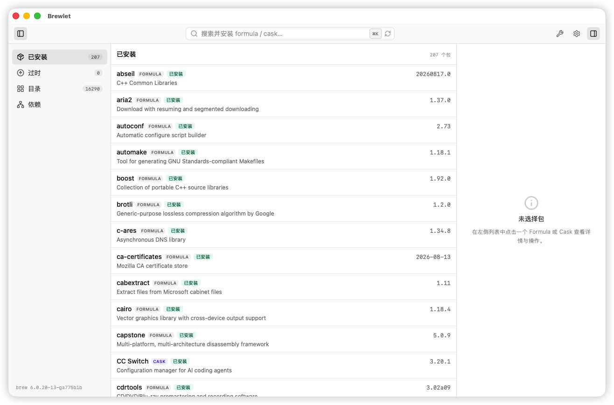
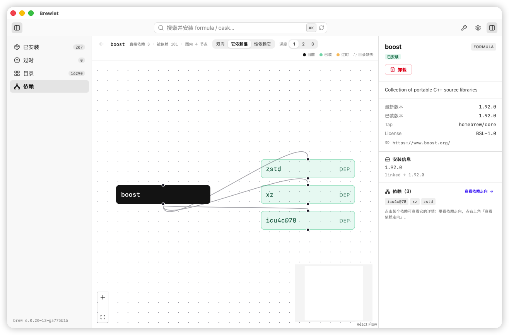
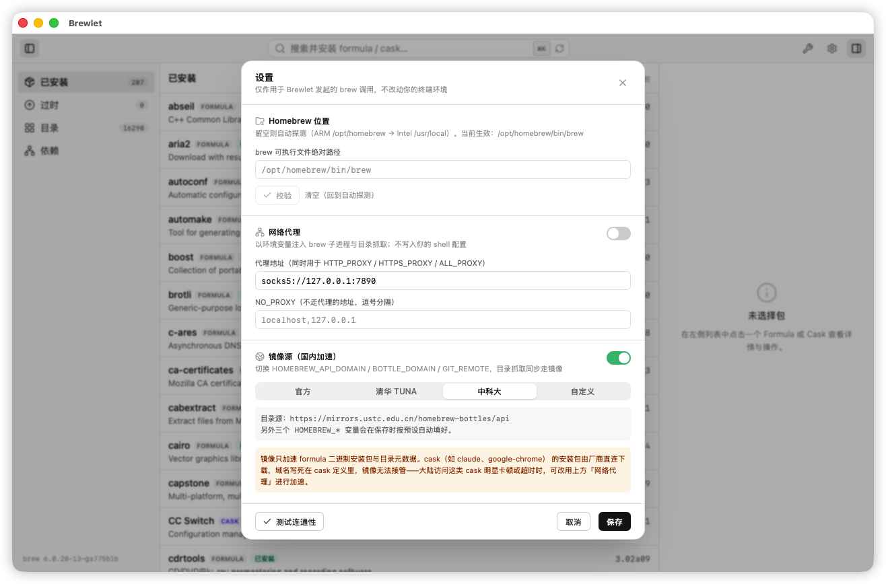

# Brewlet

> Free & open-source macOS GUI for Homebrew.

Brewlet 是 macOS 上一款免费开源的 Homebrew 图形化管理工具，基于 **Tauri 2（Rust）+ React 19 / TypeScript**。它是 Homebrew CLI 的可视化外壳——不绑架、不代替 CLI，所有操作最终都走 Homebrew 官方命令行与 JSON 数据源（`brew --json=v2` / `formulae.brew.sh`）。

## 功能

- **目录浏览与搜索**：Formula / Cask 可分类型、按状态（已安装 / 可升级 / 已锁定 / Keg-only / 已弃用）筛选，虚拟滚动支持数千条
- **包管理**：已安装列表、过时列表、单包安装 / 升级 / 卸载，带实时进度与取消
- **依赖图**：正向 + 反向依赖可视化（dagre 布局），点节点深入、可返回，深度可调
- **全局搜索**：工具栏常驻搜索框（⌘K 聚焦），列表支持 ↑↓ / Home / End 键盘导航
- **设置面板**：brew 路径覆盖、网络代理（单地址注入 HTTP / HTTPS / ALL_PROXY）、国内镜像源（清华 / 中科大 / 自定义）
- **维护操作**：`brew update` / `upgrade` / `cleanup` / `autoremove`
- **镜像连通性测试**：综合代理 + 镜像源，一键测试连通
- **体验细节**：三栏可折叠、macOS 原生标题栏、深色模式、Escape 快捷语义、操作队列

## 界面预览

| 主界面 · 已安装 | 依赖图 | 设置 |
|---|---|---|
|  |  |  |

## 安装

从 [Releases](https://github.com/workerOn9/brewlet/releases) 下载最新的 `.dmg` 安装包。

> 当前产物未签名，首次打开请 **右键应用 → 打开** 确认，或到「系统设置 → 隐私与安全性 → 仍要打开」。
> 若仍提示「已损坏 / 无法打开」，可在本机清除隔离属性并重新签名（ad-hoc）后再打开：
>
> ```bash
> xattr -cr /Applications/Brewlet.app
> codesign --force --deep --sign - /Applications/Brewlet.app
> ```
>
> 目前产物为 **Apple Silicon (aarch64)**。

## 从源码构建

### 环境要求

- [Rust](https://rustup.rs/)（stable）
- [Bun](https://bun.sh/)
- [Xcode Command Line Tools](https://developer.apple.com/xcode/)
- [Homebrew](https://brew.sh/)

### 开发

```bash
bun install
bun run tauri dev
```

### 打包 DMG

```bash
bun run tauri build
```

产物位于 `src-tauri/target/release/bundle/dmg/`。

发布到 GitHub：推送 `v*` tag（如 `v0.1.0`），[GitHub Actions](.github/workflows/release.yml) 会自动构建并上传 DMG 到 Release。

## 技术栈

| 层 | 选型 |
|---|---|
| 桌面框架 | Tauri 2（tokio / serde / reqwest） |
| 前端 | React 19 + TypeScript（strict）+ Vite |
| 状态 | @tanstack/react-query（server）+ zustand（UI） |
| UI | Tailwind CSS v4 + lucide-react |
| 大列表 | @tanstack/react-virtual |
| 依赖图 | @xyflow/react + @dagrejs/dagre |

## 设计约束

数据一律走结构化 JSON，绝不黑盒解析终端文本；密码零接触（特权操作走系统授权）；类型安全端到端（TS strict，Rust 无 `unwrap`）。

## License

[Apache-2.0](LICENSE)
